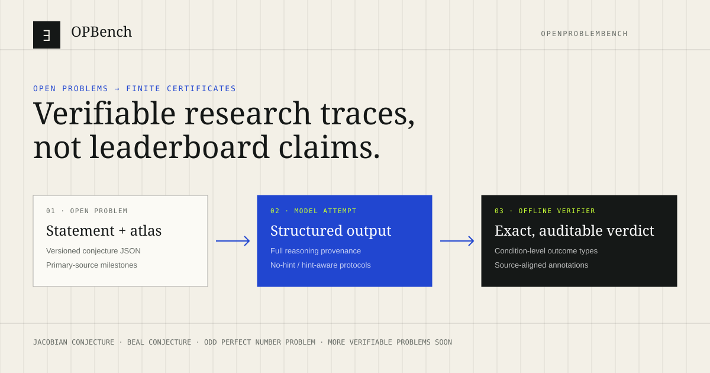

# OPBench · OpenProblemBench

[](https://ai4sgi.github.io/Conjecture/)
[](eval/)
[](LICENSE)



OPBench is an extensible benchmark and public research interface for evaluating AI attempts on open mathematical problems. It focuses on the part of frontier reasoning that can be made concrete: structured witnesses, exact arithmetic, symbolic identities, proof artifacts, and other finite certificates that an independent program can check.

The website is deliberately compact. Select a conjecture once; its statement, research atlas, benchmark tasks, evaluation matrix, full model traces, and symbolic verification contract update together. The current release includes the Jacobian Conjecture, the Beal Conjecture, and the Odd Perfect Number Problem.

## News

- **2026-08-10** — Added the Beal Conjecture and Odd Perfect Number Problem, their existing model results, exact offline verifiers, and the data-driven multi-conjecture interface.
- **2026-08-03** — Refreshed the five-model Jacobian evaluation set and exposed deterministic outcome attribution for every run.
- **2026-07-24** — Launched the first OPBench case study with five Jacobian counterexample-construction tasks.

## Motivation

Frontier mathematics is not well represented by short-answer accuracy alone. An open problem may require a long search, and a plausible narrative can still hide a fatal algebraic error. At the same time, many proposed advances contain a finite core that is perfectly testable: a tuple of integers, a factorization, a polynomial map, a collision witness, or a formal proof term.

OPBench separates those layers. A model may explore freely, but its scored claim is reduced to a declared output schema and an offline verifier. API failures, formatting failures, failed mathematical conditions, exact passes, and research qualifications that remain outside automation are reported as different outcomes. No LLM judge decides the mathematical verdict.

To our knowledge, OPBench is the first benchmark organized systematically around open-problem attempts whose decisive finite claims are paired with executable, problem-specific verification. It is intentionally a growing benchmark: more verifiable problems and richer optimization tracks are available soon.

## What the benchmark contains

Each conjecture is represented by one editable JSON file under [`conjectures/`](conjectures/). [`conjectures/index.json`](conjectures/index.json) alone controls which conjectures appear and in what order. A conjecture file declares:

1. its overview and explanatory visualization;
2. the mathematical statement;
3. a dated Mathematical Atlas with primary-source links;
4. benchmark task metadata and hint policy;
5. evaluation copy and adaptive outcome categories;
6. the Symbolic Lab output contract and offline verifier path;
7. relative problem and result paths—never machine-specific absolute paths.

The source problem datasets stay in [`problems/`](problems/), and model outputs stay in [`results/`](results/). The site generator joins them without rewriting the problem sources. Evaluation annotations live inside their corresponding source result as `opbench_annotation`, so a future rerun cannot silently drift away from a separate annotation file.

## Website organization

The public interface combines five connected views:

1. **AI news and progress on open conjectures** — a standalone, source-linked timeline that distinguishes attempts, expert review, exact certificates, and formal verification.
2. **AI-verifiable evaluation** — problem-specific outcome statistics and a model × task matrix that adapt to any task count and to hinted or no-hint protocols.
3. **Interactive verification** — output contracts, condition-level verifier traces, inspectable offline code, and an in-browser polynomial laboratory for the Jacobian case.
4. **Open discussion** — a moderated community surface for missing constraints, candidate directions, and verifier gaps.
5. **Reproducible provenance** — relative source paths, full model traces, source hashes, and annotations aligned with the original result JSON.

## Reproduce the site data

```bash
npm install
npm run data
npm run test:data
npm run typecheck
npm run build
```

Run the source-aligned annotation pass explicitly after adding or replacing evaluation results:

```bash
npm run data:annotate
```

The two number-theory verifiers can also be run directly:

```bash
python eval/eval_number_theory_001_beal_conjecture.py results/number_theory_001_beal_conjecture/number_theory_001_beal_conjecture_gpt-5.2_0.json
python eval/eval_number_theory_002_odd_perfect_number.py results/number_theory_002_odd_perfect_number/number_theory_002_odd_perfect_number_glm-5.2_0.json
```

A nonzero exit status means the candidate did not satisfy every strict condition; the verifier still emits its complete JSON diagnosis.

## Initialize new conjecture pages

The initializer converts JSON objects from a problem JSONL source into standalone conjecture-page skeletons. It never modifies the input and refuses to overwrite an existing output file.

```bash
node scripts/init-conjectures-from-jsonl.mjs problems/number_theory.jsonl \
  --output-dir /tmp/opbench-conjectures
```

A nonempty `optimization.problem` creates a second optimization task; an empty optimization field keeps the conjecture at one evaluation task. Review the generated atlas links, localized copy, visualization, and verifier path before adding a new file to `conjectures/index.json`.

## Repository map

```text
conjectures/                 One content/configuration JSON per conjecture
problems/                    Authoritative benchmark problem datasets
results/                     Source model outputs with aligned annotations
eval/                        Exact offline verifiers and evaluation runners
news/frontier_news.jsonl     Standalone AI-mathematics news timeline
scripts/                     Initializer, annotator, and site-data generator
public/data/evaluations/     One lazy-loaded evaluation bundle per conjecture
src/components/              Reusable adaptive website views
tests/                       Data, API, responsive, and interaction audits
```

## Vision

OPBench aims to become a rigorous, open platform for verifiable evaluation and public discussion around open problems. We welcome additional conjectures, sharper intermediate questions, executable verification conditions, independent audits, and constructive criticism. The long-term goal is not to reward confident claims; it is to make research attempts inspectable enough that the community can learn from both exact successes and precisely diagnosed failures.

OPBench is produced by **Shanghai Artificial Intelligence Laboratory**. Contact **yufangchen@pjlab.org.cn** with problem proposals, verifier contributions, or collaboration ideas.

## Citation

```bibtex
@misc{exomind2026opbench,
  author       = {{ExoMind Team}},
  title        = {{OPBench: A Verifiable Benchmark and Open Platform for AI on Open Problems}},
  year         = {2026},
  institution  = {Shanghai Artificial Intelligence Laboratory},
  howpublished = {Web benchmark and research interface},
  url          = {https://ai4sgi.github.io/Conjecture/},
  note         = {Accessed 2026-08-10}
}
```
